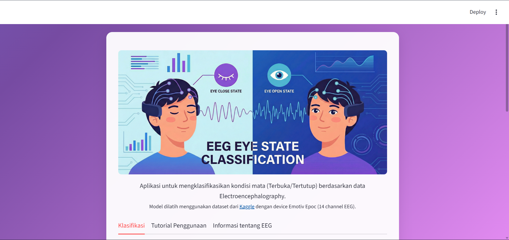

# EEG Eye State Classification



## Anggota Kelompok

- Jason Natanael Krisyanto (140810220051)
- Fahri Nizar Argubi (140810220054)
- Muhammad Nabil Indiharto (140810220067)

Aplikasi web untuk klasifikasi kondisi mata (terbuka/tertutup) berdasarkan data EEG menggunakan Streamlit dan model deep learning.

## Deskripsi

Aplikasi ini menggunakan tiga model machine learning (LSTM, CNN, EEGNet) untuk menganalisis sinyal EEG dari 14 channel dan mengklasifikasikan eye state. Model dilatih menggunakan dataset dari Kaggle.

## Fitur

- Klasifikasi dengan LSTM, CNN, dan EEGNet
- Input data via CSV upload atau text input
- Visualisasi sinyal EEG
- Prediksi dengan confidence score
- Tutorial dan informasi EEG

## Dataset

Dataset: [Kaggle Eye State Classification EEG Dataset](https://www.kaggle.com/datasets/robikscube/eye-state-classification-eeg-dataset/data)
- Device: Emotiv Epoc
- Channels: 14 (AF3, F7, F3, FC5, T7, P7, O1, O2, P8, T8, FC6, F4, F8, AF4)

## Instalasi dan Menjalankan

### Persyaratan
- Python 3.7+
- TensorFlow, Streamlit, NumPy, Pandas, Matplotlib

### Langkah-langkah
1. Install dependencies:
   ```
   pip install -r requirements.txt
   ```

2. Pastikan folder `model/` berisi file `lstm.h5`, `cnn.h5`, `eegnet.h5`

3. Jalankan aplikasi:
   ```
   streamlit run app.py
   ```

4. Akses di browser (http://localhost:8501)

## Penggunaan

1. Pilih model (LSTM/CNN/EEGNet)
2. Input data EEG (upload CSV atau text)
3. Lihat visualisasi sinyal
4. Klik "Prediksi" untuk hasil

### Format Data
Data dalam format CSV dengan 14 kolom sesuai urutan channel EEG.

## Struktur Proyek

```
eeg-streamlit/
├── app.py          # Aplikasi utama
├── tutorial.py     # Tutorial penggunaan
├── eeg_info.py     # Informasi EEG
├── model/          # Model ML (.h5 files)
├── images/         # Gambar
└── README.md       # Dokumentasi
```